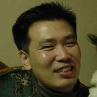

## About Me

Hi! My name is DongInn Kim. I am a Ph.D. student at the Computer Science
Department of Indiana University-Bloomington under the guidance of Prof. L Jean
Camp. I work for the IU CSI CTF (Catch The Flag) team and I am also working on
the Open Source Cluster Application Resources
([OSCAR](https://oscar-cluster.github.io/oscar/)) as a core developer. My
research interests include software engineering, clustering computing, and
systems security.

* IU CSI [CTF](https://en.wikipedia.org/wiki/Capture_the_flag): Catch The Flag
  team of Indiana University

## Research Interest

My current research focuses on the reverse engineering for the security of IoT
devices and building an intelligent dynamic analysis tool on the top of
existing static/dynamic analysis security tools.

### Current Work
- detect malicious domains from the ch registry database: planning to apply
  machine learning
- binary analysis to investigate any possible penetrations in Intel SGX: working
  with SGX reading group
- [practice](http://iuctf.gitlab.io/notes/) the CTF exercises / problems with
  some various reverse engineering tools (e.g. radare2, unicorn, capstone,
  keystone, ...)

### Past Work (Summer in 2017)
- renovating the security toolbar, which is an extension of Firefox to make web
  browsing more secure.
- work on the "CUTS CertProbe and CertWarehouse" for collecting and compiling
  the Public key
  certificates. <= [Previous work: [PDF](https://iu.box.com/s/tcymb04cebttwlik3dojfm06ovibifkq)]

## Publications

1. DongInn Kim, Jeffrey M. Squyres, and Andrew Lumsdaine: *The Introduction of
   the OSCAR Database API (ODA)* =>
   [PDF](http://www.crest.iu.edu/publications/prints/2006/kim:oda:oscar06.pdf)
1. DongInn Kim, Jeffrey M. Squyres, and Andrew Lumsdaine: *Revamping the OSCAR
   database: A Flexible Approach to Cluster Configuration Data Management.* =>
   [PDF](http://www.crest.iu.edu/publications/prints/2005/kim05:_revam_oscar.pdf)

## Technical Skills

Machine learning (ML) models that I have implmented with R:

Name | What does it do
-----|----------------
[K-Means](https://en.wikipedia.org/wiki/K-means_clustering) | Unsupervised, non-parametric ML to classify data with the given K value
[E-M](https://en.wikipedia.org/wiki/Expectation%E2%80%93maximization_algorithm) | Unsupervised, parametric ML to find maximum likelihood or maximum a posteriori
[Linear Regression](https://en.wikipedia.org/wiki/Linear_regression/) | Supervised, parametric ML to find the linear model between given data sets (X,..., Y)
[Logistic Regression](https://en.wikipedia.org/wiki/Logistic_regression/) | Supervised, parametric ML to find the categorical model between dependent variables
[KNN](https://en.wikipedia.org/wiki/K-nearest_neighbors_algorithm) | Unsupervised, non-parametric ML for classification and regression
[Naive Bayes](https://en.wikipedia.org/wiki/Naive_Bayes_classifier) | Semi-supervised, parametric ML for the probabilistic classifier with the assumption of [IDD](https://en.wikipedia.org/wiki/Independent_and_identically_distributed_random_variables)

Here is the list of the tools that I am currently learning:

Name | What does it do
-----|----------------
[Radare2](https://github.com/radare/radare2) | Reverse engineering framework
[Unicorn](http://iuctf.gitlab.io/notes/unicorn_blog.html) | CPU emulator ([U](http://www.unicorn-engine.org/))
[Capstone](http://www.capstone-engine.org/) | Disassembly framework
[Keystone](http://www.keystone-engine.org/) | Assembler framework
[Pwndbg](https://github.com/pwndbg/pwndbg) | GDB plug-in to make debugging with GDB much easier

---

## Research Colleagues

* [L Jean Camp](http://www.ljean.com/): Professor, School of Informatics and
  Computing, Indiana University
* [Andrew Lumsdaine](https://www.pnnl.gov/science/staff/staff_info.asp?staff_num=9045):
  UW-PNNL Distinguished Faculty Fellow and Affiliate Professor of Computer
  Science, University of Washington
