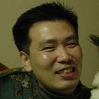

## About Me

Hi! My name is DongInn Kim. I am a Ph.D. student at the Computer Science
Department of Indiana University-Bloomington under the guidance of Prof. L Jean
Camp. I work for the IU CSI CTF (Catch The Flag) team and I am also working on
the Open Source Cluster Application Resources
([OSCAR](https://oscar-cluster.github.io/oscar/)) as a core developer. My
research interests include software engineering, clustering computing, and
systems security.

## Research Interest

My current research focuses on the reverse engineering for the security of IoT
devices and building an intelligent dynamic analysis tool on the top of
existing static/dynamic analysis security tools.

### Current work
- renovating the security toolbar, which is an extension of Firefox to make the web browsing more secure.
- work on the "CUTS CertProbe and CertWarehouse" for collecting and compiling the Public key certificates.

## Publications

1. DongInn Kim, Jeffrey M. Squyres, and Andrew Lumsdaine: *The Introduction of the OSCAR Database API (ODA)* 
=> [PDF](http://www.crest.iu.edu/publications/prints/2006/kim:oda:oscar06.pdf)
2. DongInn Kim, Jeffrey M. Squyres, and Andrew Lumsdaine: *Revamping the OSCAR database: A Flexible Approach to Cluster Configuration Data Management.*
=> [PDF](http://www.crest.iu.edu/publications/prints/2005/kim05:_revam_oscar.pdf)

## Technical Skills

Here is the list of the tools that I am currently learning:

Name | What does it do
-----|----------------
[Radare2](https://github.com/radare/radare2) | Reverse engineering framework
[Unicorn](http://www.unicorn-engine.org/) | CPU Emulator
[Capstone](http://www.capstone-engine.org/) | Disassembly framework
[Keystone](http://www.keystone-engine.org/) | Assembler framework
[Pwndbg](https://github.com/pwndbg/pwndbg) | GDB plug-in to make debuggin with GDB much easier

---

## References

* [L Jean Camp](http://www.ljean.com/): Professor, School of Informatics and Computing, Indiana University
* IU CSI [CTF](https://en.wikipedia.org/wiki/Capture_the_flag): Catch The Flag team of Indiana University 
